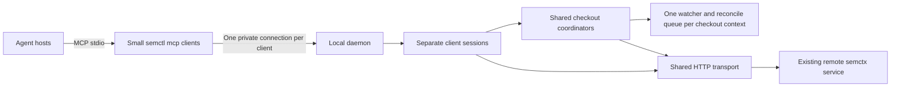

# Shared local daemon feasibility

Date: 2026-09-17. Measurements started on 2026-09-16 UTC.
Repository revision: `93efefd27ab7d73242579100345752437d20be84`.
Package: `semctl 0.1.19`. Locked MCP library: `rmcp 1.8.0`.

## Recommendation

A shared local daemon is feasible. Build a prototype before selecting production
limits. The strongest case is many MCP connections attached to the same physical
checkout. A daemon can give those connections one watcher, one reconcile queue,
one content-decision cache, and one runtime.

Keep `semctl mcp` as a small stdio client that connects to the daemon. Keep the
tool names, arguments, responses, and host approval behavior. This preserves the
current plugin configuration. It leaves one small client process per MCP
connection, plus one daemon. A native HTTP transport can later remove those
client processes where the host supports the required connection context.

The main work is state ownership and lifecycle management. Adding a socket alone
will not remove duplicate work. Cloning the current `McpServer` across unrelated
clients would also share their default repository and other session state.

This investigation includes source review and local process measurements.
It does not include a daemon implementation or a production capacity test.

## Current architecture and duplicated work

The remote semctx service already performs search, graph queries, and embedding.
The proposed daemon would consolidate the local semctl layer. It would not move
the remote index into a local process.

Both checked-in plugin manifests launch `semctl mcp`. Each launch creates a
Tokio runtime, an HTTP client, and an MCP server. The MCP server serves one stdio
connection. Count actual MCP child processes when estimating cost. Several model
agents can share a host connection, depending on the host.

| Area | Current behavior | Consequence with many processes |
| --- | --- | --- |
| Runtime | `main` uses the default multithreaded Tokio runtime. | Each invocation owns worker threads, including hook invocations. |
| MCP state | `Shared` belongs to one `McpServer`. | Its `Arc` shares handler clones inside that process only. |
| Checkout watching | `watch_once` deduplicates canonical roots within that server. | Two processes watching the same root still install two watchers. |
| Reconciliation | Startup, filesystem events, and a default 60-second timer call the same sync engine. | Each process runs its own scan and manifest request. |
| Scan cache | Every scan reads and hashes each candidate. The cache reuses content-filter decisions. | A cache hit does not eliminate file reads or hashing. |
| Sync ownership | A cache mutex serializes that owner's startup, event, and timer syncs. | It does not serialize independent processes or separate CLI index invocations. |
| HTTP | `Client` clones reuse a pool and capability cache within the process. | Separate processes create separate pools and capability checks. |
| Uploads | Each large sync permits four parallel upload requests. | Concurrency can multiply across processes and checkouts. |
| Job status | `JobRegistry` stores the latest job by codebase ID. | Several checkouts of one codebase can overwrite the same status slot. |
| Credentials and edits | These already use cross-process file locks. | Preserve those protections. A daemon is not needed to introduce them. |

Evidence: [runtime](../src/main.rs#L32),
[MCP ownership and startup](../src/mcp/mod.rs#L73),
[background lifecycle](../src/sync/background.rs#L39),
[watcher](../src/sync/watcher.rs#L40),
[scan](../src/sync/scan.rs#L65),
[cache](../src/sync/cache.rs#L37),
[sync and job registry](../src/sync/mod.rs#L70),
[upload limits](../src/sync/upload.rs#L13),
[HTTP client](../src/client/mod.rs#L32),
[credential locking](../src/auth/session.rs#L138),
[edit locking](../src/editing.rs#L630), and the
[Claude](../plugins/semctx/.claude-plugin/plugin.json) and
[Codex](../plugins/semctx/.codex-plugin/plugin.json) manifests.

Background MCP indexing uses `SyncCache::default()`. The optional persistent
cache supports separate CLI runs, but the MCP lifecycle does not use it.
Enabling that cache would still leave full scans and separate watchers.

## Measurements

The release binary was built from the revision above with `cargo build --release
--locked`. The host was Linux x86-64 with 16 available CPUs and Rust 1.98.1.
The harness started 1, 30, and 100 MCP processes. Each process completed MCP
initialization and listed all 39 tools.

The idle case pinned a synthetic codebase without a local checkout. The watched
case attached every process to the same synthetic directory. That directory
contained 2,000 files in 20 subdirectories, with 8,178,000 source bytes.
The harness used a temporary configuration directory, a synthetic token, and a
loopback mock HTTP server. It disabled update checks and periodic reconciliation
to isolate startup and one filesystem edit. The mock requested no content
uploads. No production credentials, source files, or indexing jobs were used.

| Case | Processes | Total PSS, MiB | Total RSS, MiB | Threads | File descriptors | inotify watch entries |
| --- | ---: | ---: | ---: | ---: | ---: | ---: |
| Idle, no checkout | 1 | 9.1 | 11.7 | 19 | 9 | 0 |
| Idle, no checkout | 30 | 55.4 | 346.0 | 573 | 270 | 0 |
| Idle, no checkout | 100 | 162.6 | 1,156.1 | 1,910 | 900 | 0 |
| Same checkout | 1 | 20.0 | 22.6 | 22 | 12 | 25 |
| Same checkout | 30 | 667.6 | 1,012.4 | 684 | 360 | 750 |
| Same checkout | 100 | 1,935.2 | 3,106.5 | 2,256 | 1,200 | 2,500 |

PSS means proportional set size. It assigns each process a share of shared
memory pages. RSS means resident set size. Summed RSS counts shared pages more
than once. Use PSS for this comparison. Neither measure includes all kernel
watcher costs or the full filesystem page cache.

| Processes on one checkout | Startup manifests | Manifests after one file edit | Source bytes represented after the edit | Aggregate process CPU time during edit observation |
| ---: | ---: | ---: | ---: | ---: |
| 1 | 1 | 1 | 8,178,012 | 0.08 s |
| 30 | 30 | 30 | 245,340,360 | 10.68 s |
| 100 | 100 | 100 | 817,801,200 | 65.16 s |

All watched processes used the same checkout source identity. The 100-process
case still submitted 100 manifests for one edit. The byte count is the sum of
file sizes in those manifests. It is not network payload size or physical disk
traffic. The scanner reads and hashes those candidates before submission.
Cached filesystem pages can satisfy the reads. CPU time is summed across semctl
processes. It is not elapsed time and excludes their short-lived Git children.

These are single-run observations on a synthetic directory. Memory was sampled
after startup and a two-second settling period. Allocator retention and blocking
thread lifetimes affect the samples. The harness's batch attach time includes
sequential response collection and is not a latency benchmark. The experiment
does not measure real search traffic, uploads, embedding, credential refresh,
large repositories, Windows, macOS, or daemon performance.

Raw data: [default runtime](mcp-process-baseline.json).
Reproduction harness: [measure_mcp_processes.py](measure_mcp_processes.py).

A second run set `TOKIO_WORKER_THREADS=2` for 100 processes. Idle thread count
fell from 1,910 to 503. Watched thread count fell from 2,256 to 869. Watched PSS
remained about 1.87 GiB. One edit still caused 100 manifests. All 2,500 watch
entries remained installed. This knob can reduce runtime overhead, but it does
not consolidate checkout work. Retrieval throughput under this setting was not
tested. See [two-worker results](mcp-process-two-workers.json).

`SEMCTX_MCP_RESYNC_SECS=0` disables periodic reconciliation only. Startup and
event scans still run. `SEMCTX_MCP_UPDATE_CHECK=0` removes the startup update
lookup only. Neither setting substitutes for shared ownership. The plugin also
launches short-lived `semctl hook` processes. Routing their requests through a
daemon can share backend resources, but command hooks still need a client
process unless the host integration changes. See the
[hook configuration](../plugins/semctx/hooks/hooks.json).

## Expected scaling

Let `N` be the number of MCP processes. Let `R` be the number of distinct checkout
contexts. A checkout context includes its server and authorization scope.
For checkout `r`, let `n_r` be its process count and `B_r` its candidate bytes.
For equally shared contexts, the duplication factor is `N / R`.

With the default timer, periodic candidate reads are approximately
`sum(n_r * B_r) / 60` bytes per second. A daemon with one reconcile owner per
checkout context reduces that to approximately `sum(B_r) / 60`. Both estimates
exclude event scans, retries, source-policy checks, and upload rereads.

| Workload | Expected benefit |
| --- | --- |
| 100 connections, one checkout context | Up to a 100-to-1 reduction in duplicate startup, timer, and edit scans. Actual CPU and memory savings require a daemon benchmark. |
| 100 connections, ten equally shared checkout contexts | Approximately a ten-to-one reduction in duplicated scan work. |
| 100 connections, 100 separate worktrees | Each worktree still needs its own correct snapshot. Runtime sharing and bounded scheduling remain useful, but scan volume does not collapse to one checkout. |
| Many requests against remote-only codebases | Runtime and HTTP pool sharing help. There are no local watchers to consolidate. |

Separate Git worktrees can share a codebase ID. They must retain distinct source
identities and complete manifests. The existing identity derives from the
installation ID and canonical checkout path. Do not deduplicate by Git remote,
repository name, branch, or codebase ID alone.
See [checkout identity](../src/codebase/identity.rs#L18).

A daemon does not inherently reduce the number of agent search requests. Query
result caching would require authorization, checkout, revision, and freshness
rules. It is not required for the first prototype.

## Proposed ownership and transport



Run one daemon per operating-system user and configuration/security boundary.
One process can serve several repositories. Do not share a daemon across
different users, containers, or host sandbox boundaries by default.

| Owner | State |
| --- | --- |
| Client session | Launch directory, default/pinned codebase, explicit server and tenant choices, credential source, tool policy, protocol negotiation, pending requests, and client notifications. |
| Checkout coordinator | Canonical root and source identity, source-policy context, watcher, reconcile queue, scan cache, current sync job, and initial-index readiness. |
| Daemon | Listener, lifecycle management, bounded task scheduling, reusable HTTP transport, scoped capability caches, and diagnostics. |

Use a coordinator key that includes normalized server URL, authorization
context, tenant, checkout source identity, and applicable source-policy context.
Keep the current codebase ID as validated binding state. The server can move a
checkout to another codebase after a Git remote change. Rebind it without
creating two reconcile owners. Keep incompatible credential scopes separate.
For the same remote checkout source, reject conflicting source-policy contexts
until the conflict is resolved. Two coordinators must not alternately publish
different complete manifests for that one source.

Keep one MCP service instance per client connection. Each instance delegates to
the shared coordinator registry and existing query, sync, and editing engines.
Separate connections let clients reuse JSON-RPC request IDs without collisions.
The client should select a small runtime before entering the current
`#[tokio::main]` path. Otherwise the client keeps much of today's thread cost.

| Transport option | Assessment |
| --- | --- |
| Private Unix socket; Windows named pipe; stdio clients | Recommended first prototype. Retains existing host configuration and launch context. Requires platform-specific listener security and a small versioned attach handshake. |
| Streamable HTTP directly from hosts | Can achieve one local semctl process. Requires host compatibility checks and explicit repository/authentication context. An HTTP connection does not supply the host's working directory or environment. |
| Elect one existing process to own only sync | Possible narrower experiment. Leaves full MCP runtimes and HTTP clients duplicated. Needs ownership transfer and shared readiness/status. |
| One daemon per checkout | Easier isolation, but 100 worktrees still produce 100 daemons. It does not meet the broad multiplexing objective. |

The locked `rmcp 1.8.0` supports asynchronous read/write streams and exposes a
Streamable HTTP transport. Its stream support provides a direct starting point
for private socket connections. HTTP server features are not enabled in this
package today. See the [rmcp transport documentation](https://docs.rs/rmcp/1.8.0/rmcp/transport/index.html)
and [dependency features](../Cargo.toml#L85).

Specify the supported MCP revision during implementation. The 2025-11-25 HTTP
transport has optional protocol sessions. The 2026-07-28 revision removes those
protocol sessions and changes cancellation behavior. Application session
isolation remains necessary. Do not assume an `MCP-Session-Id` design applies to
every revision. See the [2025 transport specification](https://modelcontextprotocol.io/specification/2025-11-25/basic/transports)
and [2026 HTTP transport specification](https://modelcontextprotocol.io/specification/2026-07-28/basic/transports/streamable-http).

## Required correctness and lifecycle changes

1. **Make invocation context explicit.** `attach_local_root` reads the process
   working directory. Relative path selectors also use that directory.
   Authentication reads `SEMCTX_TOKEN` from the process environment. Git policy
   resolution uses environment-selected configuration. A daemon must receive
   validated session context and pass it through typed state. It must never
   change its working directory or environment to serve another client.
   Transfer only the required context over the protected local connection.
   Never put invocation tokens in endpoint names, command arguments, or logs.
   See [path binding](../src/mcp/mod.rs#L260),
   [cached-root attachment](../src/mcp/mod.rs#L728),
   [token selection](../src/auth/session.rs#L103), and
   [Git policy](../src/sync/policy/git.rs).

2. **Separate authentication state from HTTP transport sharing.** `Client`
   shares mutable tenant state among its clones. Do not clone one tenant-bearing
   client across independent sessions. Preserve explicit tenant precedence,
   credential generation checks, logout invalidation, and server binding.
   Treat an invocation token as session-specific. Never use the first client's
   environment as the daemon's credentials for all clients. Partition or end
   stale sessions when the stored login changes. Keep existing disk locks for
   standalone CLI commands and old processes.
   Give capability caches an invalidation policy. A process-lifetime cache can
   otherwise retain old server capabilities for the daemon's entire lifetime.

3. **Move all sync triggers into one coordinator.** Startup, watch events,
   periodic reconciliation, explicit indexing, and edit-triggered sync must use
   the existing sync engine through that coordinator. Coalesce pending triggers.
   If a file changes during a scan, run a follow-up scan. Keep byte verification,
   source-policy validation, complete manifests, and cancellation ownership.
   A mutex that merely queues 100 full scans does not provide the intended gain.

4. **Scope readiness and status to the checkout.** Share the first-index job
   across clients attached to that checkout. Keep `sync_status` callable while
   embedding runs. The current registry retains gates for a session's lifetime,
   and an empty cross-codebase selector waits for all gates in that registry.
   Making that registry daemon-global would let unrelated indexing block other
   sessions. Define query-specific membership and explicit failure/retry states.
   Key status and watcher checks by checkout context, not only codebase ID.
   See [readiness](../src/mcp/readiness.rs#L10) and
   [status lookup](../src/mcp/tools.rs#L719).

5. **Own background tasks explicitly.** Current watcher and timer tasks are
   detached and live until process exit. A daemon needs cancellation handles,
   client leases, reference counts, and an idle release policy. One disconnected
   client must not stop another client's watcher. Bound caches and completed job
   records. A failed first index must have a recovery path that does not require
   restarting every client. Reconcile after restart before claiming freshness.

6. **Bound aggregate concurrency.** Separate interactive request capacity from
   scan/upload capacity. Apply global and per-checkout limits. Reserve capacity
   for status, cancellation, and health requests. Bound response buffers and
   queued work for slow clients. The current four-upload limit applies to each
   sync, so it is not a daemon-wide limit. Tune limits with measurements.

7. **Preserve edit authorization and transaction behavior.** Keep approval at
   the host boundary. Preserve source identity, graph generation, path, and
   preimage checks. Retain the apply/undo checkout lock and commit cancellation
   rules. A daemon with broader filesystem access must not bypass a host's
   sandbox restrictions. Never automatically replay a mutation after a lost
   response. Report an uncertain result and use retained edit history to inspect
   the outcome. See [edit application](../src/editing.rs#L100).

8. **Handle startup, upgrades, and mixed versions.** Use an operating-system
   lock to elect one daemon during simultaneous client startup. Verify endpoint
   ownership and negotiate the internal protocol before attaching. Use an
   owner-only socket directory or a restricted pipe. For local HTTP, validate
   Origin, authenticate clients, and bind to loopback, as required or recommended
   by the [MCP transport specification](https://modelcontextprotocol.io/specification/2025-11-25/basic/transports).
   Define stale endpoint recovery, graceful drain, and version mismatch errors.
   Do not silently launch a full standalone watcher when daemon attachment fails.
   That fallback could restore duplication during overload.

Legacy processes and standalone `semctl index` can still submit syncs during a
transition. Route updated CLI indexing through the coordinator. Evaluate a
shared ownership lock for updated standalone mode. Existing older binaries will
not honor a new lock. Require their restart during rollout or verify remote
arbitration before claiming one writer. The remote service's same-source job
ordering and stale-manifest rejection were not inspected in this repository.

## Implementation sequence and decision gates

| Phase | Work | Exit condition |
| --- | --- | --- |
| 1. Baseline | Repeat this measurement on representative repositories. Record connection counts and distinct worktrees. | Establish current memory, scan, request, and latency costs. |
| 2. Ownership refactor | Extract session context and checkout coordinator interfaces. Keep the current stdio entry point. Reuse the current engines and wire types. | Existing compatibility, indexing, edit, and authentication tests pass. |
| 3. Opt-in daemon | Add the private listener, small stdio client, startup election, leases, and bounded scheduling. Keep daemon code in cohesive modules. | 100 clients on one checkout produce one shared initial reconcile and one reconcile per settled edit burst. |
| 4. Failure and isolation tests | Exercise multiple checkouts, credentials, disconnects, restarts, and mixed versions. | No wrong-checkout results, unintended uploads, duplicate mutation replay, or leaked watchers. |
| 5. Deployment integration | Add status/stop diagnostics, upgrade handling, and optional native HTTP host configuration. | Each supported host preserves launch context, tool approval, cancellation, and reconnect behavior. |

The transport prototype is moderate work. A production daemon is a larger
change because it adds a service lifecycle and removes process isolation.
Source structure supports the change: query, sync, and editing already have
shared engines. The current MCP `Shared` object still combines several owners.
Split those owners before adding another responsibility to the large MCP files.

Use this validation matrix for the prototype:

| Dimension | Cases and required observations |
| --- | --- |
| Connections and roots | 1, 30, and 100 clients; one root, ten roots, and 100 worktrees; two roots with the same codebase ID. |
| Workload | Idle, simultaneous startup, periodic tick, edit burst, branch switch, large upload, concurrent retrieval, and short-lived hook calls. |
| Isolation | Different launch directories, relative selectors, pinned IDs, canonical reads, tenants, tokens, configuration directories, and source policies. |
| Initial indexing | Explicit consent, two simultaneous callers, failed embedding, retry, client disconnect, and daemon restart during the first job. |
| Failure | Daemon crash, stale endpoint, 100 simultaneous reconnects, incompatible client version, remote outage, auth expiry, logout, deleted checkout, and slow client. |
| Edits | Concurrent editor save, apply/undo contention, cancellation during commit, formatter completion, and lost response after commit. |
| Metrics | PSS, threads, file descriptors, watch entries, candidate bytes hashed, manifest count, upload count, queue depth, CPU, and p50/p95/p99 tool latency. |

Set a measured latency regression budget before rollout. Require a material PSS
reduction for the 100-client shared-checkout case. Require bounded thread and
queue growth. Do not require identical scan savings when all worktrees differ.
Run native transport and filesystem tests on Linux, macOS, and Windows.

## Reproduction and verification

Run the Linux harness from the repository root:

```sh
CARGO_TARGET_DIR=/tmp/semctl-daemon-investigation-target cargo build --release --locked
python3 reports/measure_mcp_processes.py \
  /tmp/semctl-daemon-investigation-target/release/semctl \
  /tmp/mcp-process-baseline.json
python3 reports/measure_mcp_processes.py \
  /tmp/semctl-daemon-investigation-target/release/semctl \
  /tmp/mcp-process-two-workers.json --counts 100 --workers 2
```

The harness requires Python 3, Git, and readable Linux `/proc` process metrics.
It starts up to 100 semctl processes and removes its temporary files after each
case. Its temporary Git configuration is an empty regular file. Using
`/dev/null` as the watched global Git configuration caused extra policy events
in an initial trial. That trial was stopped and excluded from the saved results.

The checkout's `target/` directory is owned by root and is not writable by this
session. All Cargo build and verification output therefore uses the temporary
target directory above. Product source, dependency versions, and plugin
configuration are unchanged. The existing untracked `tests/__pycache__/` is
unrelated to this investigation.

Verification completed:

- `cargo fmt --check`: passed.
- `cargo test --workspace --locked`: passed, 316 tests across eight test binaries.
- `cargo clippy --workspace --all-targets --locked -- -D warnings`: passed.
- `RUSTDOCFLAGS="-D warnings" cargo doc --workspace --no-deps --document-private-items --locked`: passed.
- `git diff --check`: passed.
- Both measurement runs completed. Saved result invariants, report links,
  Python syntax, JSON parsing, and new-file whitespace checks passed.

No required Rust check was skipped. The Bun adapter test was not applicable
because this change does not modify the OMP TypeScript adapter.
